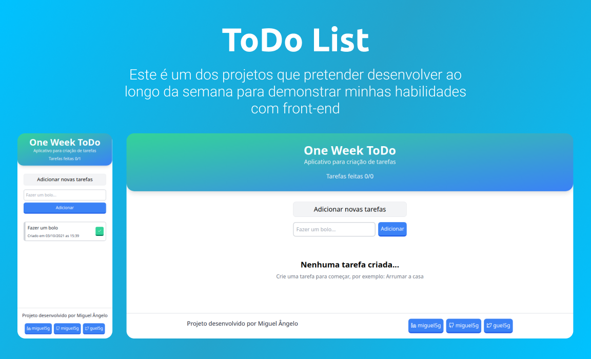

<h1 align="center">One Week ToDo List</h1>

<p align="center">
  

  <a href="https://ow-todo.vercel.app/" target="_blank">
    
  </a>
</p>

<h1 align="center">
    
</h1>

<br>

## 🧪 Tecnologias

Esse projeto foi desenvolvido com as seguintes tecnologias:

- [React](https://reactjs.org)
- [Next.JS](https://next.js.org/)
- [TailwindCSS](https://tailwindcss.com)

## 🚀 Como executar

Clone o projeto e acesse a pasta do mesmo.

```bash
git clone https://github.com/miguel5g/ow-todo-list
cd ow-todo-list
```

Para iniciá-lo, siga os passos abaixo:

```bash
# Instalar as dependências
yarn
# Iniciar o projeto
yarn dev
```

O app estará disponível no seu browser pelo endereço http://localhost:3000.

## 💻 Projeto

Este é um simples to-do list que fiz para demonstrar minhas habilidades com front-end, utilizando TailwindCSS, ReactJS e NextJS.

---

Feito com ❤️ by Miguel Ângelo!
